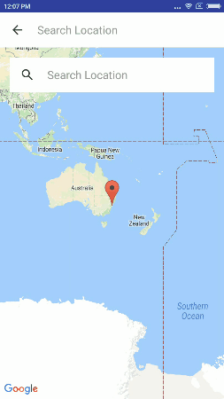

# PlaceAutoCompleteSearch

A library for android to show auto place suggestion for the searched text. Support for Android 4.0.3 (API 15) and up.

# Demo :


# Implementation
Only 4 steps are required to implement this into your project.

- Include the PlaceAutoCompleteFragment in your xml file.
- Resigter FetchPlacePredictionService service in your menifest file.
- Implement onPlaceSelectedListener Interface.
- Return the api key through getWebApiKey() CallBack method.

# Step 1 :
```xml
<RelativeLayout xmlns:android="http://schemas.android.com/apk/res/android"
    xmlns:map="http://schemas.android.com/apk/res-auto"
    xmlns:tools="http://schemas.android.com/tools"
    android:layout_width="match_parent"
    android:layout_height="match_parent">

    <fragment xmlns:tools="http://schemas.android.com/tools"
        android:id="@+id/map"
        android:name="com.google.android.gms.maps.SupportMapFragment"
        android:layout_width="match_parent"
        android:layout_height="match_parent"
        tools:context="code.cameo.placeautocomplete.MapsActivity" />
    <fragment
        android:id="@+id/place_autocomplete_fragment"
        android:name="cameo.code.placeautocomplete.PlaceAutoCompleteFragment"
        android:layout_width="match_parent"
        android:layout_height="wrap_content"
        tools:layout="@layout/fragment_search_toolbar" />
    
</RelativeLayout>
```

# Step 2 :
```xml
<service android:name="cameo.code.placeautocomplete.FetchPlacePredictionService"/>
```

# Step 3: 
```java
public class MapsActivity extends FragmentActivity implements
        PlaceAutoCompleteFragment.onPlaceSelectedListener {
    @Override
    public void onPlaceSelected(PlaceModel placeModel) { }
    @Override
    public String getWebApiKey() {}
}
```

# Step 4 :
```java
public String getWebApiKey() {
return getString(R.string.google_maps_browser_key);
}
```
This map API key is not the same API key for android application. This is an unrestricted key. You get your API key from [Here](https://console.developers.google.com/apis/credentials)

# Gradle

Step 1. Add the JitPack repository to your build file. Add it in your root build.gradle at the end of repositories:

```groovy
allprojects {
		repositories {
			...
			maven { url 'https://www.jitpack.io' }
		}
	}
```

Step 2. Add the dependency
```groovy
dependencies {
	compile 'com.github.codecameo:PlaceAutoCompleteSearch:1.0.1'
}
```

# Maven

Step 1.  Add the JitPack repository to your build file

```groovy
<repositories>
	<repository>
	    <id>jitpack.io</id>
	    <url>https://jitpack.io</url>
	</repository>
</repositories>
```

Step 2. Add the dependency
```groovy
<dependency>
	   <groupId>com.github.codecameo</groupId>
	   <artifactId>PlaceAutoCompleteSearch</artifactId>
	   <version>1.0.1</version>
</dependency>
```
# License

MIT License

Copyright (c) 2017 Code Cameo

Permission is hereby granted, free of charge, to any person obtaining a copy of this software and associated documentation files (the "Software"), to deal in the Software without restriction, including without limitation the rights to use, copy, modify, merge, publish, distribute, sublicense, and/or sell copies of the Software, and to permit persons to whom the Software is furnished to do so, subject to the following conditions:

The above copyright notice and this permission notice shall be included in all copies or substantial portions of the Software.

THE SOFTWARE IS PROVIDED "AS IS", WITHOUT WARRANTY OF ANY KIND, EXPRESS OR IMPLIED, INCLUDING BUT NOT LIMITED TO THE WARRANTIES OF MERCHANTABILITY, FITNESS FOR A PARTICULAR PURPOSE AND NONINFRINGEMENT. IN NO EVENT SHALL THE AUTHORS OR COPYRIGHT HOLDERS BE LIABLE FOR ANY CLAIM, DAMAGES OR OTHER LIABILITY, WHETHER IN AN ACTION OF CONTRACT, TORT OR OTHERWISE, ARISING FROM, OUT OF OR IN CONNECTION WITH THE SOFTWARE OR THE USE OR OTHER DEALINGS IN THE SOFTWARE.
